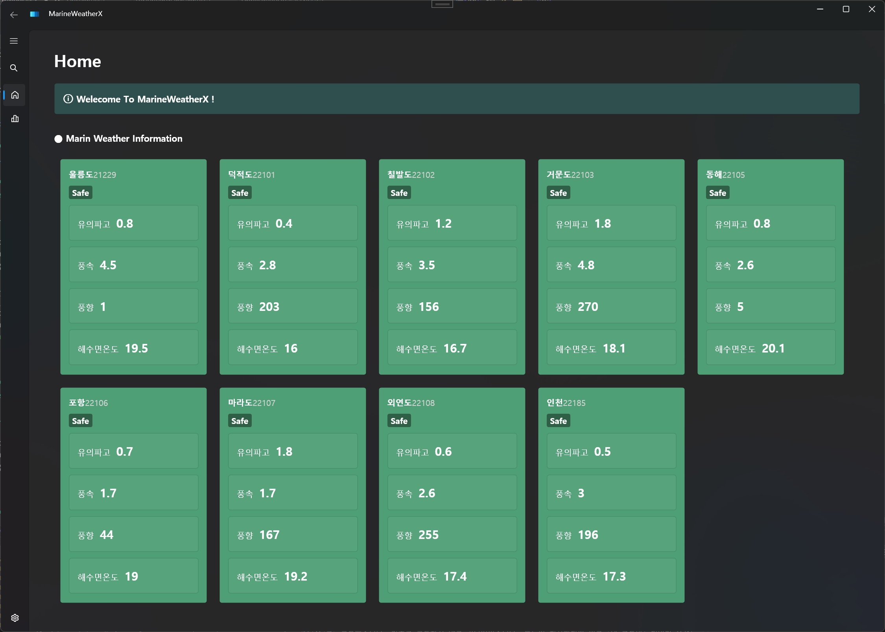

# MarineWeatherX

## 소개
해양 종합 관측자료(기상청 Open API)를 시각화하여 **풍속 (WS)**·**유의파고 (WH)** 기반 위험도를 한눈에 파악할 수 있는 WPF 대시보드입니다.

  

 

## 목차
- [MarineWeatherX](#marineweatherx)
  - [소개](#소개)
  - [목차](#목차)
  - [특징](#특징)
  - [요구 사항](#요구-사항)
  - [To Do](#to-do)

## 특징
- .NET Generic Host와 DI 컨테이너를 기반으로 WPF 프로젝트 초기 환경 자동화 구성
- WPF.UI 라이브러리 + **MVVM** 패턴을 활용한 해양 기상 대시보드 UI 설계·구현
- dotnet user-secrets에 기상청 API Key 무노출 관리
- 기상청 해양 종합 관측자료 API 파싱 모듈 개발
- ItemsControl + WrapPanel 조합으로 화면 크기에 따라 자동 재배치되는 반응형 카드 레이아웃 구축
- 풍속(WS)·유의파고(WH)를 활용한 위험도 평가 알고리즘 구현

## 요구 사항
- Windows 11
- .NET 9.0 Runtime
- Visual Studio 2022 (17.13.3)

## To Do
- [ ] PostgreSQL기반 해양 데이터 아카이브 & 통계 기능 제공